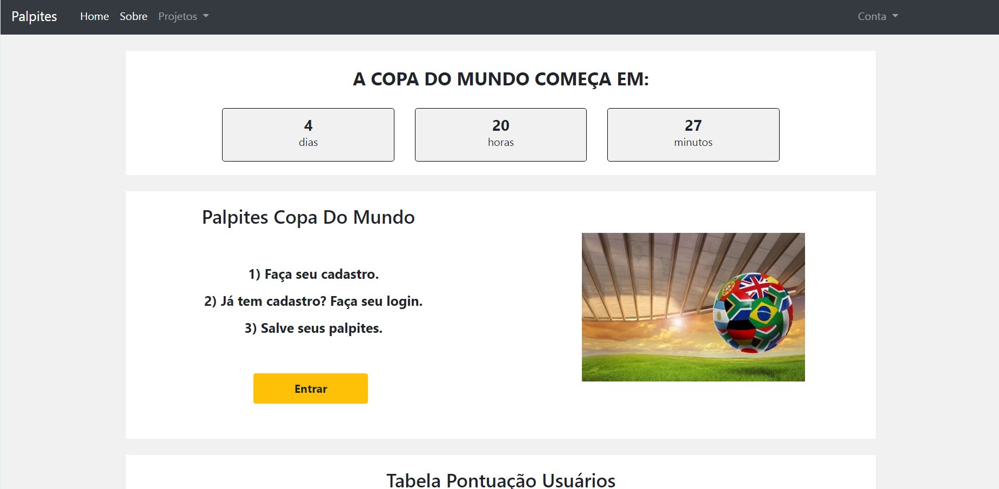
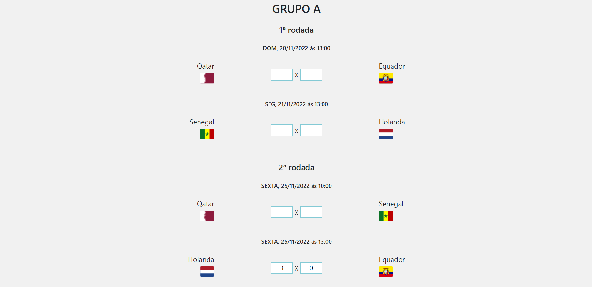

# App Palpites Copa
Este repositório trata-se da de uma aplicação web com a temática sobre palpites dos jogos da copa do mundo 2022.

# APRESENTACAO
Construir uma aplicação web para que o usuário seja capaz de:
- Visualizar o layout da pagina independente do tamanho da tela do dispositivo;
- Visualizar , ver e salvar os resultados dos jogos.
- Ser capaz de realizar um cadastro de usuario;
- Efetuar login com o usuário cadastrado;
- Acompanhar tabela de classificação dos usuários cadastrados

# METODOLOGIA
Aplicação de conceitos em:
- Python
- Django
- HTML;
- CSS;
- Bootstrap;
- Layouts Responsivos.
- Banco de Dados

# SCREENSHOTS DO PROJETO

# LINK DO PROJETO
Para visualizar o projeto no seu navegador utilize o link abaixo:

https://palpites-copa.herokuapp.com
